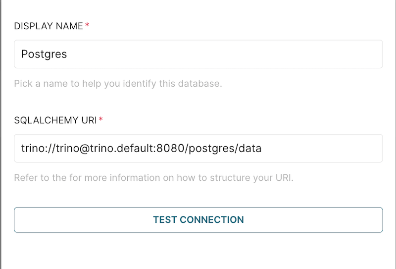
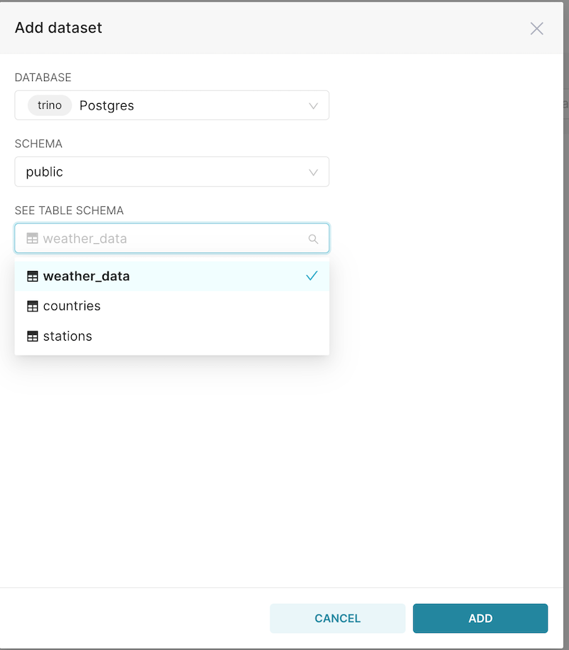
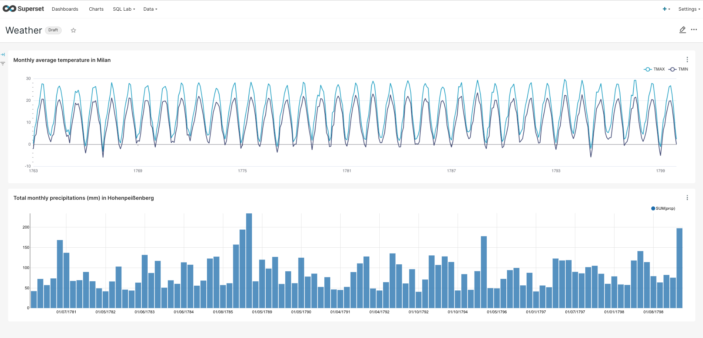

# Playing with some data

## Using Argo workflows to load some data into Postgres

We will be using [NOAA Global Historical Climatology Network Daily](https://registry.opendata.aws/noaa-ghcn/), a dataset of global weather observations dating back to the 18th century. Documentation is available [here](https://github.com/awslabs/open-data-docs/tree/main/docs/noaa/noaa-ghcn).

We will download the data from its Amazon bucket and send it to our Postgres instance **(and our datalake as Iceberg tables?)**.

But first, create a secret with minio's credentials on the argo namespace.
```
kubectl apply -f minio-secret.yaml -n argo
```


The workflow `download-weather-data.yaml` can be run with parameters, to indicate which decade span one wishes to download. For instance, the following command will download all the files for the years [1750, 1751, 1752, ..., 1778, 1779] if they are present.

```
argo submit -n argo --watch download-weather-data.yaml -p start-decade=175 -p end-decade=177
```

This workflow will also download information about the stations where the weather observations are registered.

**Falta:**
- Enviar datos al data lake también
- Configurar el paralelismo máximo
- Borrar carpeta de minio


## Accessing the data through the Trino CLI

To access de cli:

```
kubectl exec -it pod/trino-cli -- trino --server trino:8080
```

If the workflow run successfully, you should see three tables (`stations`, `weather_data` and `countries`) when running:

```
show tables from postgres.public;
```

We can use standard SQL to view and manipulate the data:

Preview the data:

```
select * from postgres.public.weather_data limit 10;
select * from postgres.public.stations limit 10;
```

Create a table filtering only precipitation data.

```
create table precipitations as 
select (id, date, value) from postgres.public.weather_data where ELEMENT='PRCP';
```

Or store temperatures by filtering min and max values, and converting value column to degree Celsius.
```
create table temperatures as
select id, date, element, cast(value as real)/10.0 as temperature FROM
weather_data where element in ('TMIN', 'TMAX');
```


## Accessing the data through Superset

Port-forward the Superset service, and access with credentials "admin"/"admin".

```
kubectl port-forward service/superset 8088:8088 -n superset
```

Add the database and all the tables to Superset through the UI (see Deployment for more detailed instructions):





Once the tables are loaded, clicking on them will take you to the Explore page, where you can create tables and graphs (Charts) to populate your Dashboards.

You can also use SQL Lab to run queries the same way you would run them through the Trino CLI, but **omitting the catalog name**.

If the website fails, check that the port-forward is still running.





