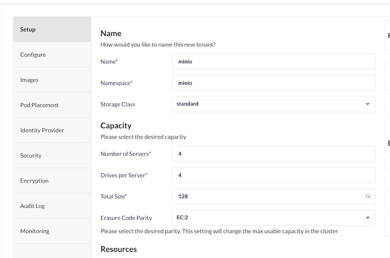
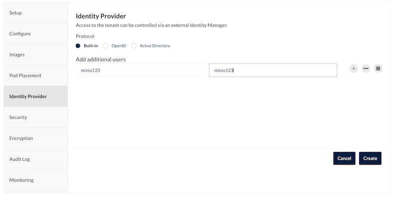
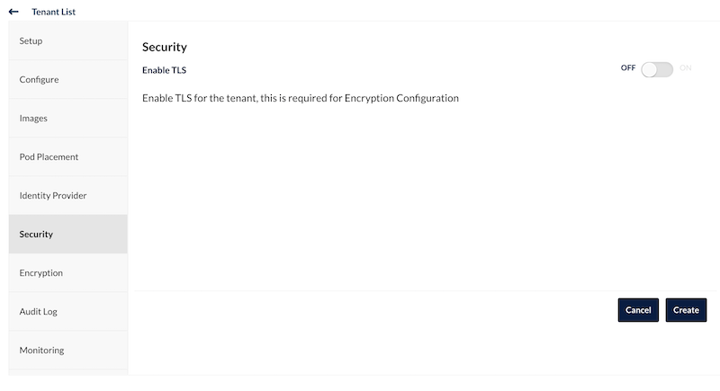
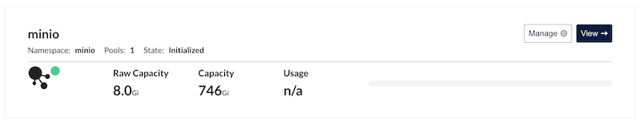

- [1. Part 1: setting up storage and the workflow orchestrator](#1-part-1-setting-up-storage-and-the-workflow-orchestrator)
	- [1.1. Prerequisites](#11-prerequisites)
	- [1.2. Set up the cluster](#12-set-up-the-cluster)
	- [1.3. Install Minio](#13-install-minio)
	- [1.4. Install PostgreSQL](#14-install-postgresql)
		- [1.4.1. Access Posgres](#141-access-posgres)
		- [1.4.2. Delete the Postgres cluster](#142-delete-the-postgres-cluster)
	- [1.5. Install Argo Workflows](#15-install-argo-workflows)
		- [1.5.1. Using Argo Workflows](#151-using-argo-workflows)
	- [1.6. Examples](#16-examples)


# 1. Part 1: setting up storage and the workflow orchestrator

## 1.1. Prerequisites

1. In order to try the architecture locally, we will use [Kind](https://kind.sigs.k8s.io/), a tool for running Kubernetes clusters using Docker containers as nodes. Therefore, Docker should be up and running.

3. [Kubectl](https://kubernetes.io/docs/tasks/tools/#kubectl), the Kubernetes command-line tool.

4. In order to be able to install some of the programs in the Kubernetes cluster, you will need [helm](https://helm.sh/) and [krew](https://krew.sigs.k8s.io/docs/user-guide/setup/install/).

## 1.2. Set up the cluster

With the `deployment` folder as working directory run

```
kind create cluster --config kind-cluster.yaml
```

This will create a Kubernetes cluster with one control plane node and three worker nodes.
You should be able to see the docker containers with the names 'kind-control-plane', and 'kind-worker1' to 'kind-worker3' when checking with `docker ps`.

In order to stop and delete the cluster, do:

```
kind delete cluster
```

## 1.3. Install Minio

First, create a namespace for Minio's deployment and prepare persistent volumes. Then, install [Minio operator](https://github.com/minio/operator) using krew.

Note that we are using the default storage class provided by Kind. In any other scenario, you might need to create a [storage class](https://kubernetes.io/docs/concepts/storage/storage-classes/) and change the `storageClassName` field on [minio-persistent-volumes.yaml](minio-persistent-volumes.yaml). Moreover, **Minio's tool [DirectPV](https://github.com/minio/directpv) can be used to automatically discover and mount drives.**

```
kubectl create ns minio
kubectl apply -f persistent-volumes.yaml
kubectl krew update
kubectl krew install minio
kubectl minio init
```

When the minio operator is up and running (`kubectl get pods -n minio-operator`), do the following to access the operator through your browser on localhost:9090.

```
kubectl minio proxy -n minio-operator
```

A JWT token will be printed on the console, which is necessary to log into the operator.

For testing purposes, we will create an unsecured Minio server pool with 4 servers and 4 drives per server, as per the official recommendation:

> MinIO recommends a minimum of 4 nodes per server pool with 4 drives per server. With the default erasure code parity setting of EC:4 , this topology can continue serving read and write operations despite the loss of up to 4 drives or one node.

See additional deployment guidelines [here](https://docs.min.io/minio/baremetal/installation/deploy-minio-distributed.html#id5).

Configure the Minio cluster as shown in the pictures. 
In the example, we allocate a total 128 Gi of space; but you can modify this to suit your needs and space restrictions. 

Additionally, since this is just a demo, you may disable audit logs 
and monitoring to save resources.









Once the minio deployment is ready, you can stop the proxy for the operator.




This Minio tenant can be removed through the operator or by deleting its namespace (`kubectl delete ns minio`).


**Access and delete Minio**

Now Minio is deployed in the namespace `minio`. Kubernetes internal apps can access it through `minio.minio:80`, with the admin user *minio123* and password *minio123*.

It can be accessed through the command line via Minio [mc](https://docs.min.io/docs/minio-client-complete-guide.html), and also via the [aws cli](https://docs.min.io/docs/aws-cli-with-minio.html).

Externally, all minio tenants can be delted and managed from the Minio operator. Alternatively,  we can easily access the Minio tenant console directly by port-forwarding one of minio's pods:

```
kubectl port-forward -n minio minio-pool-0-0 9090:9090
```

## 1.4. Install PostgreSQL

We will use Postgres as a database for storing data, but we will also need it to provide databases for other tools we will use, such as [Superset](https://superset.apache.org/), [Hive Metastore](https://cwiki.apache.org/confluence/display/Hive/AdminManual+Metastore+3.0+Administration#AdminManualMetastore3.0Administration-RunningtheMetastoreWithoutHive) or [Argo Workflows](https://argoproj.github.io/argo-workflows/).

We will install PostgreSQL through [Kubegres](https://www.kubegres.io/), a Kubernetes operator that deploys Postgres instances with data replication and failover enabled out-of-the box.

Again, we will be using Kind's default storage class. If this was not the case, additional configuration steps would be necessary.

```
kubectl apply -f https://raw.githubusercontent.com/reactive-tech/kubegres/v1.15/kubegres.yaml 

kubectl wait --for=condition=ready pod --all --namespace=kubegres-system

kubectl apply -f postgres-secret.yaml
kubectl apply -f postgres-init.yaml 
kubectl apply -f postgres.yaml 

kubectl get pods -w
```

Wait for three pods (postgres-*n*-0) to be created. 

- The Secret `postgres-secret.yaml` contains the secrets for all the databases that will be created on our Postgres cluster. 

- The ConfigMap `postgres-init.yaml` contains the initialization script that will create all the databases that we will need as we install additional tools. If desired, it can be modified to perform additional initialization steps.

- The file `postgres.yaml` is a Kubegres resouce that contains the necessary information to set up the Postgres cluster.

### 1.4.1. Access Posgres

The Postgres service will be avaible for internal applications through `postgres.default:5432`.

Three databases have been created: `hivemetastore`, `superset` and `data`. You can check the access credentials on `postgres-secret.yaml`.

In order to access through localhost, use port-forward:

```
kubectl port-forward postgres-1-0 5432:5432
```

See section 6 [here](https://www.kubegres.io/doc/getting-started.html) to understand the services that were created and how they relate to each other.

### 1.4.2. Delete the Postgres cluster

If you want to delete the Postgres cluster that we just created, run:

```
kubectl delete kubegres postgres
```
## 1.5. Install Argo Workflows

We will install Argo on its own namespace, following the official quickstart [guide](https://argoproj.github.io/argo-workflows/quick-start/).

It will be configured to use our own PostgreSQL and MinIO as storage backends. MinIO, specifically, will be used by default to store artifacts between workflows.

```
kubectl create ns argo
kubectl apply -n argo -f argo.yaml
```

In [argo.yaml](argo.yaml) we configure Argo Workflows to work with our current PostgreSQL and MinIO instances. Additionally, it contains a job to create a bucket in MinIO names 'argo-workflows'. Artifacts generated during workflows will be stored here.

Create an admin :

```
kubectl create clusterrolebinding YOURNAME-cluster-admin-binding --clusterrole=cluster-admin --user=YOUREMAIL@email.com
```

### 1.5.1. Using Argo Workflows

To access the UI, use port-forward and go to: https://localhost:2746.

```
kubectl -n argo port-forward deployment/argo-server 2746:2746
```

In order to interact with Argo Workflows through the command line,
 you need to install the ARGO CLI following the instructions [here](https://github.com/argoproj/argo-workflows/releases/tag/v3.3.1). 
 After installation you will be able to, among other things:

- Submit jobs:

	````
	argo submit -n argo --watch your-workflow.yaml
	````


- Check logs for latest job:

	```
	argo logs -n argo @latest
	```
  You can also see all the pods by using `kubectl get pods` in the `argo` namespace. The logs of the pods might beku more complete through kubectl.


- Terminate the job that is running:

  ```
  argo terminate -n argo @latest
  ```

- [Delete](https://argoproj.github.io/argo-workflows/cli/argo_delete/) completed jobs

	```
	argo delete -n argo --completed
	```

## 1.6. Examples 

In the [examples](../examples) folder you'll find workflows to download raw data into MinIO and save some of this data into our PostgreSQL database. 