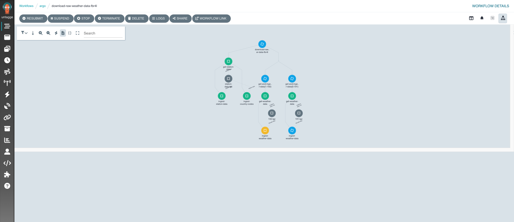

- [1.  Using storage tools and Argo Workflows](#1--using-storage-tools-and-argo-workflows)
  - [1.1. Example 1: Using Argo workflows to load raw data into MinIO](#11-example-1-using-argo-workflows-to-load-raw-data-into-minio)
  - [1.2. Example 2: Loading part of the data to PostgreSQL](#12-example-2-loading-part-of-the-data-to-postgresql)
  - [1.3. Complete example: downloading the raw data and sending it to Postgres](#13-complete-example-downloading-the-raw-data-and-sending-it-to-postgres)

# 1.  Using storage tools and Argo Workflows

We have three example workflows. One of them ([1-download-and-send-to-postgres.yaml](1-download-and-send-to-postgres.yaml)) downloads all the data to MinIO and then loads it to Postgres. Since it is a very long and complicated workflow, we have split it in two simplified workflows that can be run separately: one for downloading the data, and one for retrieving part of it and sending it to postgres.

We will be using many of Argo Workflows features, but not all. Their Github repo provides a good set of examples to showcase most of its features [here](https://github.com/argoproj/argo-workflows/tree/master/examples).

## 1.1. Example 1: Using Argo workflows to load raw data into MinIO

We will be using [NOAA Global Historical Climatology Network Daily](https://registry.opendata.aws/noaa-ghcn/), a dataset of global weather observations dating back to the 18th century. Documentation is available [here](https://github.com/awslabs/open-data-docs/tree/main/docs/noaa/noaa-ghcn).

We will download the data from its Amazon S3 bucket and send it to our MinIO instance. 

The workflow `download-raw-data.yaml` can be run with parameters, to indicate which decade span one wishes to download. For instance, the following command will download all the files for the years [1800, 1801, 1802, ..., 1819]. 

```
argo submit -n argo --watch 1-download-raw-data.yaml -p start-decade=180 -p end-decade=181
```
We've configured the workflow to download each decade separately and in parallel.

Apart from the weather observations for the indicated decades, 
this job will download two additional tables:

- ghcnd-stations.txt, which contains information regarding the stations where the data is collected, and
- ghcnd-countries.txt, which allows us to link stations to countries.


This job is an example of a workflow that uses input parameters, parallelism and the [script](https://argoproj.github.io/argo-workflows/workflow-concepts/#script) template definition. This option allows us to define simple jobs without the need to create a Docker image.

Paths indicated in the `artifact` sections are relative to MinIO bucket `argo-workflows`. We've configured it like this in [argo.yaml](../deployment/argo.yaml). 


## 1.2. Example 2: Loading part of the data to PostgreSQL

Using some of the data we downloaded earlier, we will send it to postgres.

```
argo submit -n argo --watch 1-station-data-to-postgres.yaml
```

## 1.3. Complete example: downloading the raw data and sending it to Postgres

This example showcases the complete workflow: downloading the data and sending it to the database.

 In addition to the Argo Workflows features shown in the examples above, it contains embedded DAGs, and it shows how to use artifacts created in one step as input to another one. 

Of course, the same effect (saving the data to Postgres) could be accomplished in one step without
saving to MinIO as an intermediary step. We chose this method for illustration purposes.

The workflow can be submitted as before:

```
argo submit -n argo --watch 1-download-and-send-to-postgres.yaml -p start-decade=195 -p end-decade=198
```

Be aware that files corresponding to recent years can be very big.

If you port-forward Argo Workflows, you will be able to access the UI at https://localhost:2746. From there, you can follow the workflow activity as it unfolds, see the graphical representation of the DAG and access the logs for each pod, among many other things.

```
kubectl -n argo port-forward deployment/argo-server 2746:2746
```

